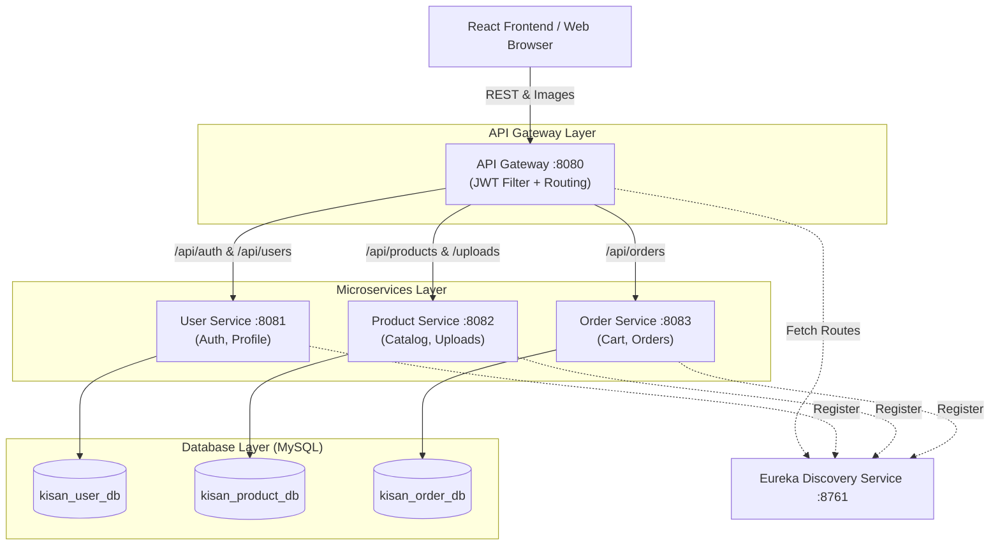
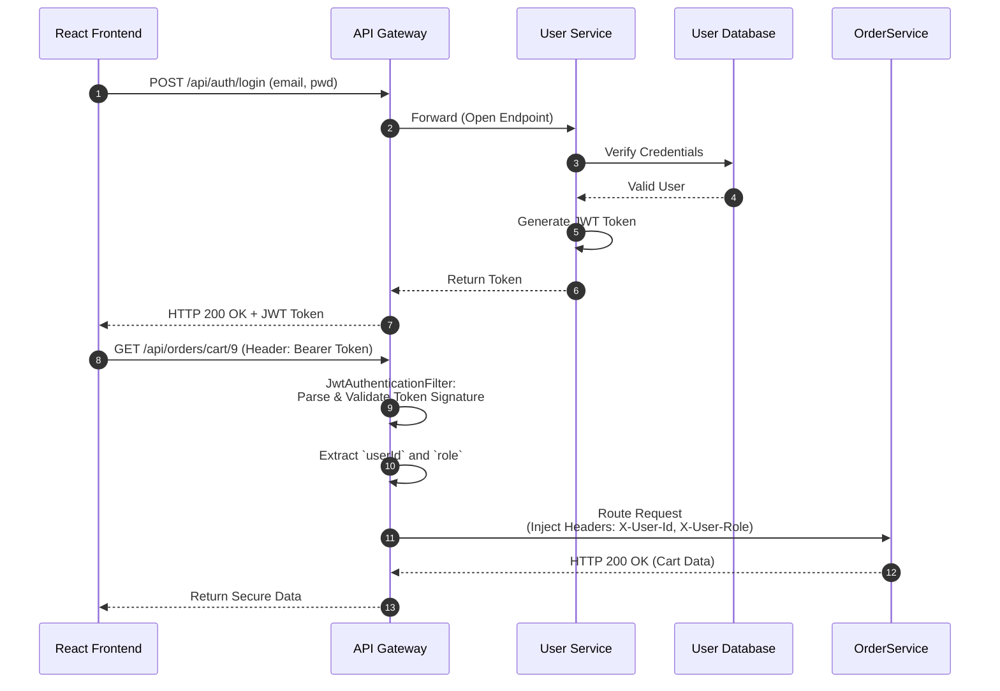
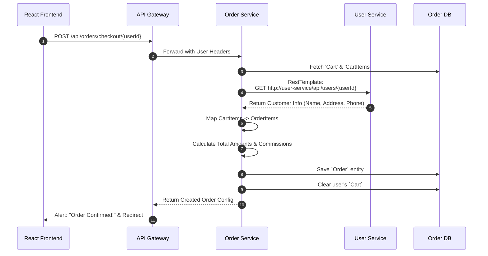
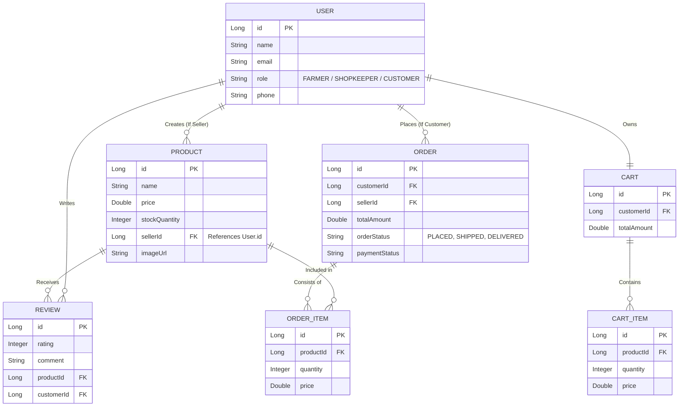
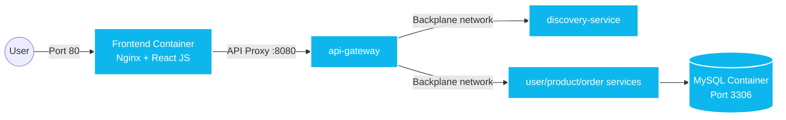

# Kissan Connect - Architecture & System Diagrams

This document illustrates the architectural design, microservice communication, deployment topology, and database relationships of the **Kissan Connect** platform. 

All diagrams are written in **Mermaid.js**. You can view these directly in VS Code (by opening the preview) or on GitHub.

---

## 1. High-Level System Architecture

This diagram shows the topology of the application, representing how the frontend communicates through the Spring Cloud Gateway to the downstream Spring Boot microservices, which each operate on their own isolated databases.

---

## 2. Authentication & Authorization Flow

This sequence demonstrates how JSON Web Tokens (JWT) are issued during login and seamlessly validated at the API Gateway level before traffic touches backend services.

---

## 3. Shopping Cart to Checkout Flow

A major feature of Kissan Connect is placing an order from the cart. Since order information relies on the customer's details, the Order Service interacts directly with the User Service.

---

## 4. Simplified Entity Relationship Diagram (ERD)

This diagram shows the primary data objects across all microservice databases and how they semantically relate to one another (using soft-links like `customerId` rather than hard foreign constraints across database boundaries).

---

## 5. Docker Architecture

This illustrates how Docker Orchestration maps external traffic to the Docker Network containers.

